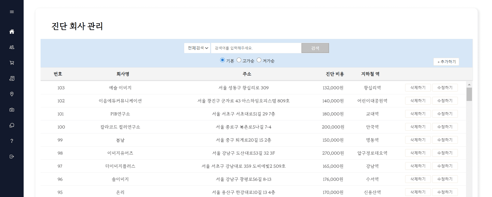

</br>

# <div align="center">:lipstick: FIND YOUR Hidden Beauty</div>

<div align="center">
    <b>"당신의 숨겨진 아름다움을 찾아서"</b></br>
    퍼스널 컬러 진단, 커뮤니티, 쇼핑몰 등 다양한 서비스를 제공하는 플랫폼, FIND YOUR Hidden Beauty입니다!</br>
    퍼스널 컬러 회사의 진단 비용 부담을 경감시키면서 관련 서비스를 다양하게 제공해 보자는 의견에서 출발하였습니다.
</div>

</br>

## 목차

- [개요](#개요)
- [프로젝트 구조](#프로젝트-구조)
- [주요 기능 - 사용자 페이지](#사용자-페이지)
- [주요 기능 - 관리자 페이지](#관리자-페이지)
- [역할 분담](#역할-분담)

</br>

## 개요

개발기간: 2023-12-05 ~ 2024-01-02</br>
멤버: 팀 환감탈태(김수연, 박혜주, 황다온, 이유진)</br>

개발환경:</br>
\- Java 12.0.2 / Spring Framework 3.1.1 / Oracle 12c Enterprise</br>
\- Apache Tomcat 9.0</br>
\- Mybatis 3.1.0</br>
\- STS 3.9.18, SQL Developer, GitHub, Google Drive</br>

</br>

## 프로젝트 구조

```
└─src
    ├─main
    │  ├─java
    │  │  ├─admin
    │  │  │  ├─contoller
    │  │  │  └─model
    │  │  ├─celeb
    │  │  │  ├─controller
    │  │  │  └─model
    │  │  ├─color
    │  │  │  ├─controller
    │  │  │  └─model
    │  │  ├─com
    │  │  │  └─spring
    │  │  │      └─ex20
    │  │  ├─company
    │  │  │  ├─controller
    │  │  │  └─model
    │  │  ├─c_board
    │  │  │  ├─controller
    │  │  │  └─model
    │  │  ├─mall
    │  │  │  ├─controller
    │  │  │  └─model
    │  │  ├─mybatis
    │  │  ├─product
    │  │  │  ├─controller
    │  │  │  └─model
    │  │  ├─q_board
    │  │  │  ├─controller
    │  │  │  └─model
    │  │  ├─users
    │  │  │  ├─controller
    │  │  │  └─model
    │  │  └─utility
    │  ├─resources
    │  └─webapp
    │      ├─resources
    │      │  ├─css
    │      │  ├─image
    │      │  ├─js
    │      │  └─uploadFolder
    │      │      ├─celeb
    │      │      └─product
    │      └─WEB-INF
    │          ├─admin
    │          ├─celeb
    │          ├─color
    │          ├─company
    │          ├─c_board
    │          ├─mall
    │          ├─product
    │          ├─q_board
    │          ├─spring
    │          │  └─appServlet
    │          ├─users
    │          └─views
    └─test
        └─resources
```

</br>

## 사용자 페이지

### [ 메인화면 ]

- 메인화면에서는 사이트에서 제공하는 전반적인 서비스에 대해 개략적으로 확인하실 수 있습니다.

|  |
| :-----------------------------------------------------------------------------------------------: |
|                             :arrow_up_small: 사용자 페이지 - 메인화면                             |

</br>

### [ 회원가입 ]

- 아이디 중복체크를 하지 않으면 회원가입할 수 없도록 제한하였습니다.
- 비밀번호와 비밀번호 확인이 일치하지 않을 경우 경고 문구가 하단에 표시됩니다.
- 회원가입 폼의 모든 란을 채워 가입할 경우, 가입 환영 페이지가 나타납니다.

|  |  |
| :-----------------------------------------------------------------------------------------------: | :-----------------------------------------------------------------------------------------------: |
|                                     :arrow_up_small: 회원가입                                     |                                 :arrow_up_small: 가입 환영 페이지                                 |

</br>

### [ 로그인 ]

- 페이지 좌측에서는 일반 로그인 및 SNS 로그인을 진행할 수 있으며, </br>페이지 우측에서는 회원가입, 아이디/비밀번호 찾기, 계정 정지 관련 문의하기를 진행할 수 있습니다.
- 비밀번호 찾기를 진행할 경우, 회원의 이메일이 요구되며 해당 이메일 주소에 임시비밀번호가 발급됩니다.

|  |  |  |
| :-----------------------------------------------------------------------------------------------: | :-----------------------------------------------------------------------------------------------: | :-----------------------------------------------------------------------------------------------: |
|                                      :arrow_up_small: 로그인                                      |                                :arrow_up_small: 임시비밀번호 발급                                 |                                  :arrow_up_small: 정지 계정 문의                                  |

  </br>

### [ AI 컬러 진단 ]

- AI 컬러 진단으로 퍼스널컬러를 진단해 볼 수 있습니다.
- 진단한 결과를 마이페이지에 저장할 수 있으며, 퍼스널컬러 진단 업체를 조회해 볼 수 있습니다.

|  |  |  |
| :-----------------------------------------------------------------------------------------------: | :-----------------------------------------------------------------------------------------------: | :-----------------------------------------------------------------------------------------------: |
|                                   :arrow_up_small: AI 컬러 진단                                   |                                    :arrow_up_small: 진단 결과                                     |                                    :arrow_up_small: 업체 조회                                     |

</br>

### [ 퍼스널 컬러란? ]

- 퍼스널 컬러 별 설명과 해당하는 연예인을 확인할 수 있습니다.

  |  |
  | :-----------------------------------------------------------------------------------------------: |
  |                                  :arrow_up_small: 퍼스널 컬러란?                                  |

</br>

### [ 마이페이지 ]

- 회원정보 조회/수정과 회원탈퇴가 가능합니다.
- 회원정보 수정에서 프로필 이미지와 자기소개란을 수정할 수 있습니다.
- 회원 탈퇴 시, 탈퇴 사유를 입력받아 사용자들의 피드백을 수집하고 서비스 개선에 활용하였습니다.
- 이밖에도 후기게시판과 문의게시판에 작성한 글과 쇼핑몰 주문내역을 조회할 수 있습니다.

|  |  |  |
| :-----------------------------------------------------------------------------------------------: | :-----------------------------------------------------------------------------------------------: | :-----------------------------------------------------------------------------------------------: |
|                                     :arrow_up_small: 회원정보                                     |                            :arrow_up_small: 게시물 관리 > 후기 게시판                             |                            :arrow_up_small: 나의 쇼핑 > 주문내역 조회                             |

</br>

### [ 후기 게시판 ]

- AI 퍼스널컬러 진단 서비스를 이용한 사용자가 후기를 남길 수 있습니다.
- 제목, 이메일, 내용 란을 기입해야 하며 후기글 수정 및 삭제를 위해 비밀번호를 기입해야 합니다.
- 작성자의 프로필사진을 클릭하면 해당 사용자의 자기소개, 작성글/답글 목록을 조회할 수 있습니다.
- 부적절한 언행을 하는 사용자의 경우 신고할 수 있으며, 신고가 5회 이상 누적될 경우 정지회원으로서 사용 정지됩니다.

|  |  |  |
| :-----------------------------------------------------------------------------------------------: | :-----------------------------------------------------------------------------------------------: | :-----------------------------------------------------------------------------------------------: |
|                                   :arrow_up_small: 후기 게시판                                    |                                   :arrow_up_small: 후기 남기기                                    |                                 :arrow_up_small: 회원 프로필 조회                                 |

</br>

### [ The Shop HB ]

- 메인, 베스트, 신상품 카테고리 별로 화장품을 조회할 수 있습니다.
- 장바구니 기능 및 결제 기능을 통해 화장품을 구매할 수 있습니다.
- 문의 게시판 기능을 통해 관리자에 문의할 수 있습니다.

  |  |  |  |
  | :-----------------------------------------------------------------------------------------------: | :-----------------------------------------------------------------------------------------------: | :-----------------------------------------------------------------------------------------------: |
  |                                      :arrow_up_small: 쇼핑몰                                      |                                     :arrow_up_small: 장바구니                                     |                                   :arrow_up_small: 결제 페이지                                    |

</br>

## 관리자 페이지

### [ 메인화면 ]

- 메인화면에서는 사용자의 방문 추이 및 탈퇴 사유를 시각적으로 조회할 수 있습니다.
- 좌측 메뉴 바를 통해서 회원, 화장품, 주문 내역, 진단 회사, 연예인, 후기 게시판, 문의 게시판을 관리할 수 있습니다.

|  |
| :-----------------------------------------------------------------------------------------------: |
|                             :arrow_up_small: 관리자 페이지 - 메인화면                             |

</br>

### [ 회원 관리 ]

- \<Hidden Beauty\>에 가입한 회원들을 조회 및 관리할 수 있습니다.
- 후기게시판에서 신고가 누적되어 제재된 사용자를 활성화할 수 있습니다.
- 이름, 아이디, 휴대폰번호를 기준으로 회원을 검색할 수 있으며, 가입 유형 및 정지 유형으로 필터링하여 조회할 수 있습니다.

|  |  |
| :-----------------------------------------------------------------------------------------------: | :-----------------------------------------------------------------------------------------------: |
|                                   :arrow_up_small: 회원 리스트                                    |                               :arrow_up_small: 정지 해제 요청 관리                                |

</br>

### [ 상품 관리 ]

- 쇼핑몰에 등록할 상품들을 등록/조회/수정/삭제할 수 있습니다.
- 브랜드, 상품명, 퍼스널컬러를 기준으로 상품을 검색할 수 있으며, 재고임박순, 누적판매량순, 가격순으로 필터링하여 조회할 수 있습니다.

|  |  |  |
| :-----------------------------------------------------------------------------------------------: | :-----------------------------------------------------------------------------------------------: | :-----------------------------------------------------------------------------------------------: |
|                                   :arrow_up_small: 상품 리스트                                    |                                    :arrow_up_small: 상품 등록                                     |                                    :arrow_up_small: 상품 수정                                     |

</br>

### [ 후기 게시판, 문의 게시판 관리 ]

- 후기 게시판 및 문의 게시판에 등록된 게시글 및 답글들을 조회/삭제할 수 있습니다.
- 제목, 작성자를 기준으로 게시글을 검색할 수 있습니다.
- 문의 게시판 관리에서는 관리자가 답글을 달 수 있습니다.

|  |  |  |
| :-----------------------------------------------------------------------------------------------: | :-----------------------------------------------------------------------------------------------: | :-----------------------------------------------------------------------------------------------: |
|                                 :arrow_up_small: 후기 게시판 관리                                 |                                 :arrow_up_small: 문의 게시판 관리                                 |                              :arrow_up_small: 문의 게시판 답글 달기                               |

</br>

### [ 진단 회사, 연예인 관리 ]

- 진단 회사 및 연예인을 등록/조회/수정/삭제할 수 있습니다.
- 회사명, 주소, 인근 지하철역을 기준으로 회사를 검색할 수 있으며, 가격순으로 필터링하여 조회할 수 있습니다.
- 이름, 퍼스널컬러를 기준으로 연예인을 검색할 수 있습니다.
- 이미지파일을 클릭하여 해당 연예인의 이미지를 즉각 조회할 수 있습니다.

|  |  |
| :-----------------------------------------------------------------------------------------------: | :-----------------------------------------------------------------------------------------------: |
|                                 :arrow_up_small: 진단 회사 리스트                                 |                                  :arrow_up_small: 연예인 리스트                                   |

</br>

### [ 주문 내역 관리]

- 주문 내역을 조회할 수 있으며, 배송 완료 처리를 수행할 수 있습니다.
- 아이디, 주문일자를 기준으로 주문내역을 검색할 수 있습니다.

|  |
| :-----------------------------------------------------------------------------------------------: |
|                                 :arrow_up_small: 주문 내역 리스트                                 |

</br>

## 역할 분담

### :blue_heart:김수연

- 퍼스널 컬러 별 특징 소개 (총 10가지 컬러별 특징, 스타일링 방법 정리)
- 게시판 내 부가기능 (비밀글, 게시글 신고 및 계정정지 등)
- 마이페이지 (회원정보 조회, 수정, 회원탈퇴)
- 회원가입 페이지 (정규표현식, 아이디 중복체크, 비밀번호 확인란 일치여부)
- 쇼핑몰
- 전체적인 사이트 디자인

</br>

### :purple_heart:박혜주

- 회원 관련 기능 (회원가입, 회원탈퇴, 회원정보수정)
- 후기게시판 내, 회원 프로필 조회 기능 (Ajax를 사용한 작성글, 답글 조회)
- 관리자 - 회원 관리 페이지 (회원 검색, 필터별 조회, 연동해제 및 회원삭제, 정보수정)
- 관리자 - 상품 관리 페이지 (상품 검색, 필터별 조회, 상품 추가/수정/삭제)
- 네이버 로그인 API 연동, 카카오 로그인 API 연동, 우편 API 연동
- 이메일 임시 비밀번호 발급 기능

</br>

### :heart:황다온

- 문의 게시판 기능 (글 등록, 수정, 삭제, 관리자만 답글 달기)
- 후기 게시판 기능 (글 등록, 수정, 삭제, 답글 달기)
- 퍼스널 컬러 별 연예인 목록 페이지
- 관리자 - 진단 회사 관리 페이지 (회사 검색, 가격 순 조회, 추가, 삭제, 수정)
- 관리자 - 연예인 관리 페이지 (연예인 검색, 추가, 삭제, 수정)
- 관리자 - 후기 게시판 관리 페이지(게시글 검색, 상세보기, 추가, 삭제)
- 관리자 - 문의 게시판 관리 페이지(게시글 검색, 상세보기, 답글 달기, 삭제)

</br>

### :green_heart:이유진

- 쇼핑몰 구매 기능, 장바구니 기능-카카오 페이 API 연동
- Ai 컬러진단 -구글 티처블 머신 사용
- 진단 업체 소개 -카카오 맵 API 연동
